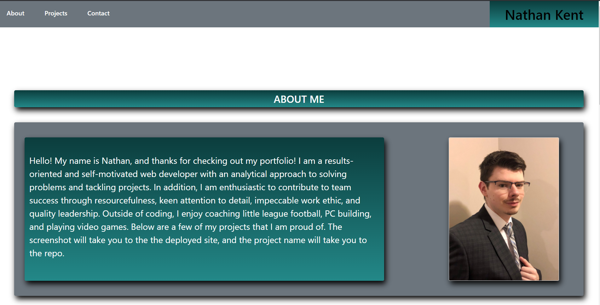
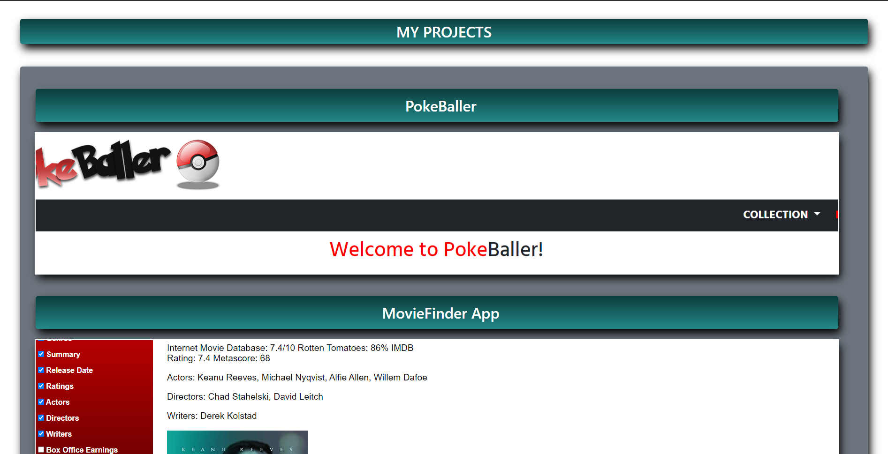

# Portfolio-Draft-3

## Table of Contents

* [Description](#description)
* [Usage](#usage)
* [Credit](#credit)
* [Questions](#questions)

## Description

Welcome to my portfolio! My portfolio gives you a short description about myself, a portrait, a few projects that I'm particularly proud of, links to contact me, and links to see my LinkedIn and resume. I am pretty happy with how the design has turned out. However, if I could improve something, it would be the responsiveness of the media queries when accessing on lower resolutions.

## Usage

To access my deployed portfolio page, you can go to https://ngkent75.github.io/Portfolio-Draft-3/

1. The navigation bar will has links that will navigate you to the different sections of my portfolio
2. In the projects section, clicking on the screenshot will take you to the deployed product while clicking on the name will take you to the repo.

## Credit

Markdown documentation: https://guides.github.com/features/mastering-markdown/#syntax

Bootstrap: https://getbootstrap.com/

## Questions
Have any questions? Feel free to reach out.

GitHub: [ngkent75](https://github.com/ngkent75)

Email: [ngkent75@gmail.com](mailto:ngkent75@gmail.com)